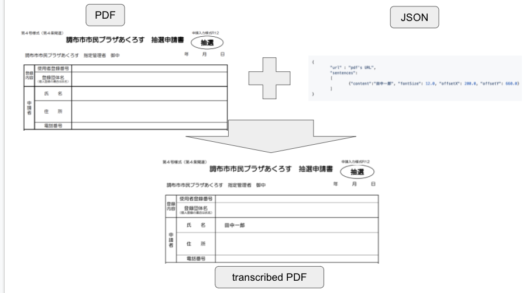
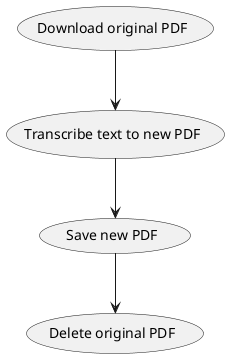

# PDF transcriber

## What to do?

This api will transcribe specified text to PDF that specified URL.

PDF + sentences -> transcribed PDF



## Process flow for design



## How to execute this application on local

```bash
./gradlew bootRun
```

## How to use this API?

```bash
curl --location --request POST 'http://localhost:8080/v1/transcribe' \
--header 'Content-Type: application/json' \
--data-raw '{
	"url" : "https://www.chofu-across.jp/CMS/wp-content/uploads/2019/06/shinseisho_shisetsu_chusen_r12.pdf",
	"sentences": 
	[
		{"content":"田中一郎", "fontSize": 12.0, "offsetX": 200.0, "offsetY": 660.0, "page": 0}
	]
}' > sample.pdf
```

